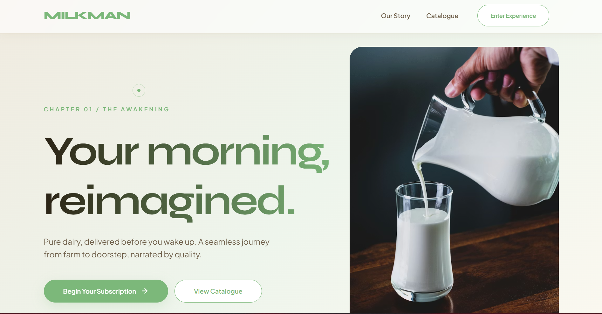
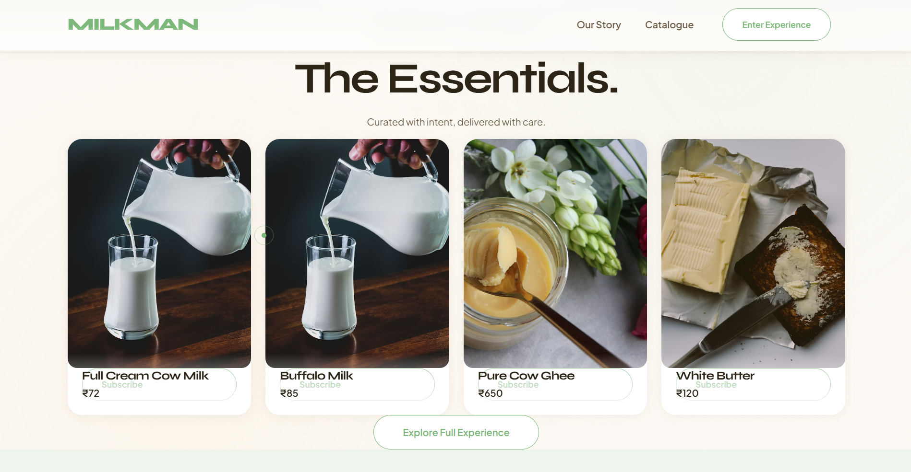
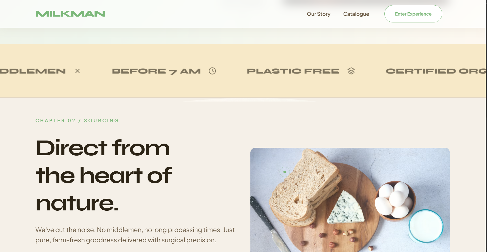
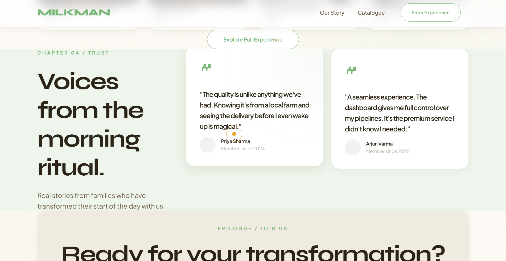
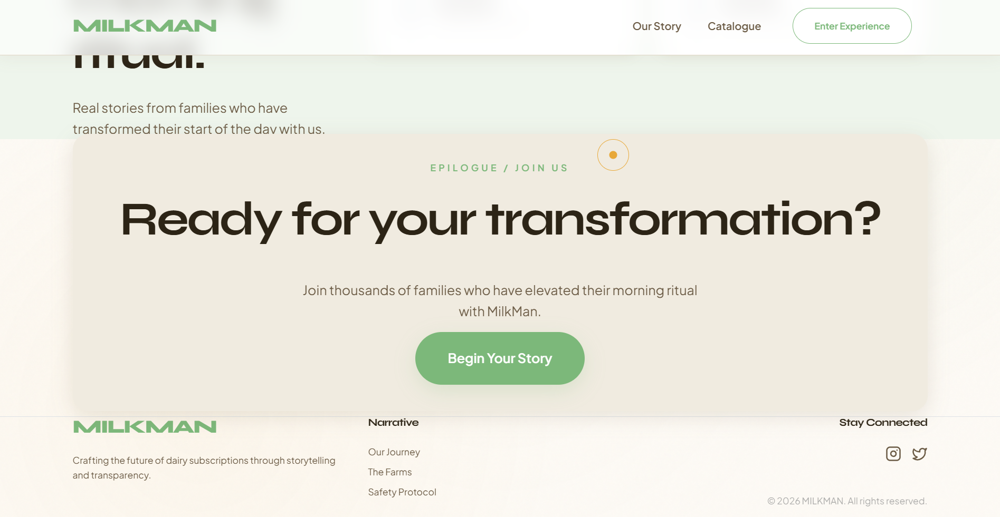
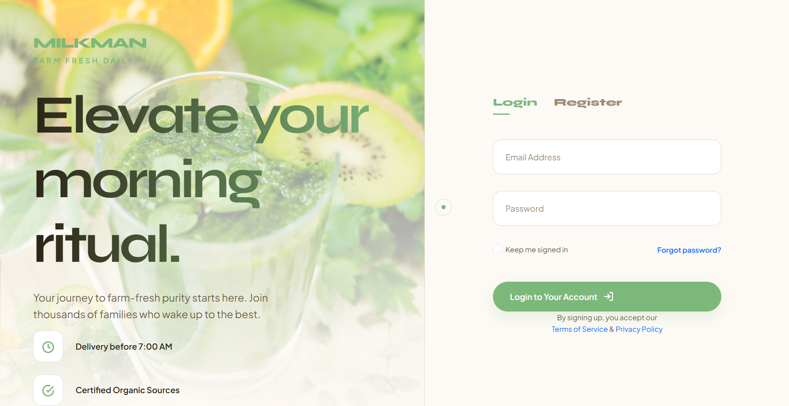
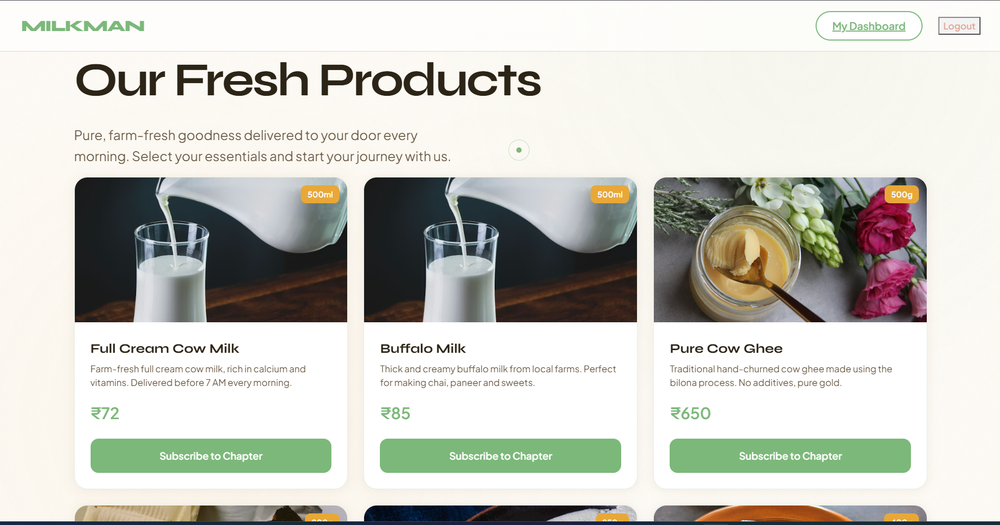
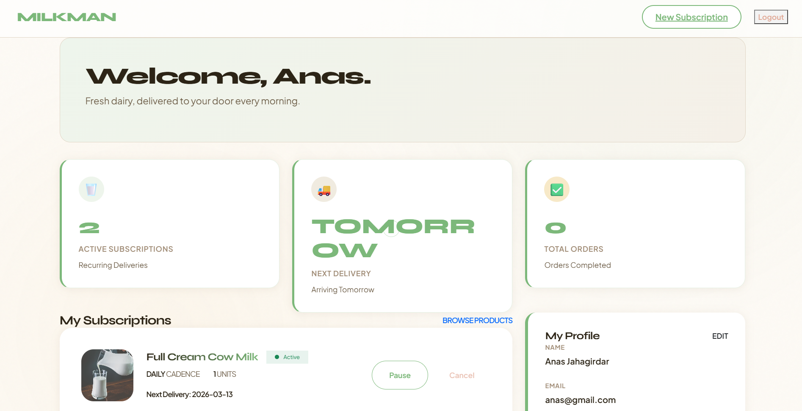
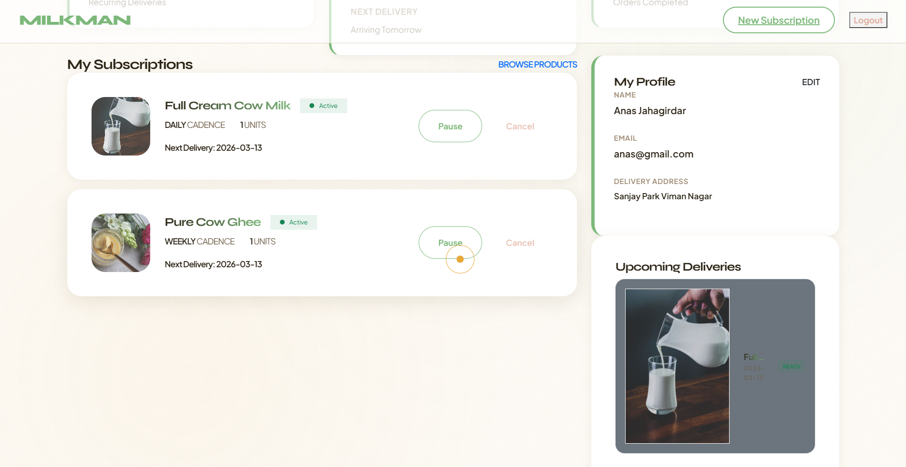

<div align="center">

# 🥛 MILKMAN

### *Your morning, reimagined.*

A full-stack dairy subscription platform. Pure dairy, delivered before you wake up.  
Customers subscribe. Staff fulfills. Admins manage. Farm to doorstep, narrated by quality.

<br/>

[](https://python.org)
[](https://flask.palletsprojects.com)
[](https://developer.mozilla.org/en-US/docs/Web/JavaScript)
[](https://getbootstrap.com)
[](https://sqlite.org)
[](https://jwt.io)

</div>

---

## 📸 Screenshots



<table>
  <tr>
    <td></td>
    <td></td>
  </tr>
  <tr>
    <td></td>
    <td></td>
  </tr>
  <tr>
    <td></td>
    <td></td>
  </tr>
  <tr>
    <td></td>
    <td></td>
  </tr>
</table>

---

## 📋 Table of Contents

- [Overview](#-overview)
- [Features](#-features)
- [Tech Stack](#-tech-stack)
- [Project Structure](#-project-structure)
- [Getting Started](#-getting-started)
- [API Reference](#-api-reference)
- [Database Schema](#-database-schema)
- [Authentication Flow](#-authentication-flow)
- [Deployment](#-deployment)
- [Roadmap](#-roadmap)

---

## 🌟 Overview

MilkMan is a production-ready dairy subscription platform that handles the full delivery lifecycle — from a customer's first subscription to a staff member marking the morning delivery complete.

The landing page is structured like a story: each scroll section is a named "Chapter", creating an editorial brand experience that sits on top of a clean, decoupled Flask REST API.

```
Customer subscribes to a product
          ↓
Subscription record saved in DB
          ↓
Cron worker generates daily Order tickets
          ↓
Staff marks Order as delivered
          ↓
Customer dashboard reflects updated history
```

---

## ✨ Features

### Customer Portal
- Secure JWT authentication — HttpOnly cookies + `Authorization: Bearer` header
- Editorial landing page with chapter-based scrollytelling layout
- Product catalog with real-time **subscription preview** and monthly cost estimator
- Flexible delivery schedules — **Daily / Alternate / Weekly**
- Personal dashboard — active subscriptions, order history, next delivery date
- **Pause & Resume** subscriptions with date-aware logic
- Fully responsive — mobile-first with CSS `clamp()` typography throughout

### Admin Panel
- Full CRUD for customers, staff, products, and categories
- Product image management served via Flask static
- Order and fulfillment tracking
- Payment status tracking per subscription

### Backend
- Flask Application Factory pattern with per-domain Blueprints
- RBAC — Customer / Staff / Admin roles
- Lightweight inline SQLite schema migrations — no external migration tool required
- CORS configured for both `file://` local dev and production Nginx proxy

---

## 🛠 Tech Stack

| Layer | Technology |
|-------|-----------|
| Backend Framework | Python Flask 3.x |
| Database | SQLite via Flask-SQLAlchemy |
| Authentication | Flask-JWT-Extended (access + refresh tokens) |
| Customer Frontend | Vanilla HTML5 / CSS3 / JavaScript ES2022 |
| UI Framework | Bootstrap 5 grid + Custom CSS Variables |
| Admin Panel | AngularJS |
| Production Server | Waitress / Gunicorn behind Nginx |
| Process Manager | PM2 |

---

## 📁 Project Structure

```
MilkMan/
│
├── backend/
│   ├── app/
│   │   ├── models/
│   │   │   ├── customer.py
│   │   │   ├── order.py
│   │   │   ├── product.py
│   │   │   ├── subscription.py
│   │   │   ├── staff.py
│   │   │   └── category.py
│   │   ├── routes/
│   │   │   ├── auth.py             # /api/auth
│   │   │   ├── customer.py         # /api/customers
│   │   │   ├── product.py          # /api/products
│   │   │   ├── subscription.py     # /api/subscriptions
│   │   │   ├── order.py            # /api/orders
│   │   │   ├── category.py         # /api/categories
│   │   │   ├── admin.py            # /api/admin
│   │   │   └── staff.py            # /api/staff
│   │   └── __init__.py             # App factory, DB init, CORS, migrations
│   ├── static/                     # Product images served by Flask
│   │   ├── cow-milk.avif
│   │   ├── ghee.avif
│   │   ├── butter.avif
│   │   ├── paneer.jpg
│   │   └── curd.avif
│   ├── instance/
│   │   └── milkman.db              # SQLite database (gitignored)
│   ├── config.py
│   ├── run.py
│   └── requirements.txt
│
├── customer-site/
│   ├── index.html                  # Landing page
│   ├── login.html                  # Login & Registration
│   ├── dashboard.html              # Customer dashboard
│   ├── products.html               # Product catalog + subscription modal
│   ├── app.js                      # Auth, apiFetch wrapper, image resolver
│   ├── runtime-config.js           # API_BASE URL config
│   └── style.css                   # CSS variables + responsive styles
│
├── admin-frontend/                 # Admin Panel (AngularJS)
│
└── screenshots/                    # README screenshots (not deployed)
```

---

## 🚀 Getting Started

### Prerequisites

- Python 3.10+
- Git

### 1. Clone the Repository

```bash
git clone https://github.com/your-username/milkman.git
cd milkman
```

### 2. Set Up the Backend

```bash
cd backend

# Create and activate virtual environment
python -m venv venv

# Windows
venv\Scripts\activate

# macOS / Linux
source venv/bin/activate

# Install dependencies
pip install -r requirements.txt
```

### 3. Start the Flask Server

```bash
python run.py
```

> API live at `http://127.0.0.1:5000`  
> SQLite database is auto-created on first run  
> Product images are served at `http://127.0.0.1:5000/static/<filename>`

### 4. Open the Customer Site

Open in your browser or use VS Code Live Server on port 5500:

```
customer-site/index.html       →  Landing page
customer-site/login.html       →  Login / Register
customer-site/products.html    →  Product catalog
customer-site/dashboard.html   →  Dashboard (requires login)
```

### 5. Create an Admin Account

```bash
cd backend
python -c "
from app import create_app, db
from app.models.staff import Staff
from werkzeug.security import generate_password_hash
app = create_app()
with app.app_context():
    admin = Staff(
        name='Admin',
        email='admin@milkman.com',
        password=generate_password_hash('admin123'),
        role='admin',
        is_active=True
    )
    db.session.add(admin)
    db.session.commit()
    print('Admin created.')
"
```

---

## 📡 API Reference

### Authentication

| Method | Endpoint | Description |
|--------|----------|-------------|
| `POST` | `/api/auth/login` | Customer login → returns JWT |
| `POST` | `/api/auth/register` | New customer registration |
| `POST` | `/api/auth/customer/logout` | Logout and clear cookies |
| `POST` | `/api/auth/admin/login` | Admin / Staff login |

### Products

| Method | Endpoint | Auth | Description |
|--------|----------|------|-------------|
| `GET` | `/api/products/` | — | List all active products |
| `GET` | `/api/products/<id>` | — | Get product detail |
| `POST` | `/api/products/` | Admin | Create product |
| `PUT` | `/api/products/<id>` | Admin | Update product |

### Subscriptions

| Method | Endpoint | Auth | Description |
|--------|----------|------|-------------|
| `GET` | `/api/subscriptions/` | ✅ | List my subscriptions |
| `POST` | `/api/subscriptions/` | ✅ | Create subscription |
| `POST` | `/api/subscriptions/preview` | ✅ | Preview monthly cost |
| `PUT` | `/api/subscriptions/<id>/pause` | ✅ | Pause subscription |
| `PUT` | `/api/subscriptions/<id>/cancel` | ✅ | Cancel subscription |

### Orders

| Method | Endpoint | Auth | Description |
|--------|----------|------|-------------|
| `GET` | `/api/orders/` | ✅ | List my orders |
| `PUT` | `/api/orders/<id>/deliver` | Staff | Mark as delivered |

---

## 🗄 Database Schema

```
Customer ──< Subscription >── Product
                │
                └──< Order
```

| Model | Key Fields |
|-------|-----------|
| Customer | `id`, `name`, `email` *(unique)*, `phone`, `address`, `password_hash`, `is_active` |
| Product | `id`, `category_id`, `name`, `price`, `unit`, `stock`, `image_url`, `is_active` |
| Subscription | `id`, `customer_id`, `product_id`, `quantity`, `frequency`, `status`, `unit_price`, `start_date`, `paused_until` |
| Order | `id`, `customer_id`, `product_id`, `subscription_id`, `quantity`, `amount`, `status`, `order_date`, `delivered_at` |
| Staff | `id`, `name`, `email`, `role` *(admin/staff)*, `password_hash`, `is_active` |

---

## 🔐 Authentication Flow

```
POST /api/auth/login
        │
        ├── ❌ Invalid → 401 Unauthorized
        │
        └── ✅ Valid
                ├── Generate access_token + refresh_token
                ├── Set HttpOnly cookie (access_token_cookie)
                └── Return tokens in JSON body
                            │
                            ▼
                Frontend saves token to sessionStorage
                            │
                            ▼
                apiFetch() injects: Authorization: Bearer <token>
                            │
                            ▼
                On 401 → clear storage → redirect to login.html
```

---

## 🌐 Deployment

### Production Architecture

```
Internet → Nginx (80 / 443)
              ├── /          →  customer-site/   (static HTML/CSS/JS)
              ├── /admin     →  admin-frontend/  (AngularJS)
              ├── /api/*     →  Flask @ :5000    (PM2 + Waitress)
              └── /static/*  →  Flask @ :5000    (product images)
```

### Nginx Config

```nginx
server {
    listen 80;
    server_name yourdomain.com;

    root /var/www/milkman/customer-site;
    index index.html;

    location /api/ {
        proxy_pass http://127.0.0.1:5000;
        proxy_set_header Host $host;
        proxy_set_header X-Real-IP $remote_addr;
    }

    location /static/ {
        proxy_pass http://127.0.0.1:5000/static/;
    }
}
```

### PM2

```bash
pm2 start "cd /var/www/milkman/backend && waitress-serve --port=5000 run:app" \
  --name milkman-api
pm2 save && pm2 startup
```

---

## 🗺 Roadmap

- [ ] Cron worker to auto-generate daily `Order` rows from active subscriptions
- [ ] Migrate to Flask-Migrate (Alembic) for proper schema versioning
- [ ] Enable `JWT_COOKIE_CSRF_PROTECT`
- [ ] Razorpay integration for subscription billing
- [ ] Push notifications for morning delivery reminders
- [ ] Admin analytics dashboard — revenue, churn, delivery stats
- [ ] React Native mobile app

---

## 🤝 Contributing

```bash
git checkout -b feature/your-feature
git commit -m 'feat: describe your change'
git push origin feature/your-feature
# then open a Pull Request
```

Follow [Conventional Commits](https://www.conventionalcommits.org/) for commit messages.

---

## 📄 License

MIT License — see `LICENSE` for details.

---

<div align="center">

Built with ☕ and 🥛 by **Anas Jahagirdar**

*If this project helped you, drop a ⭐*

</div>
